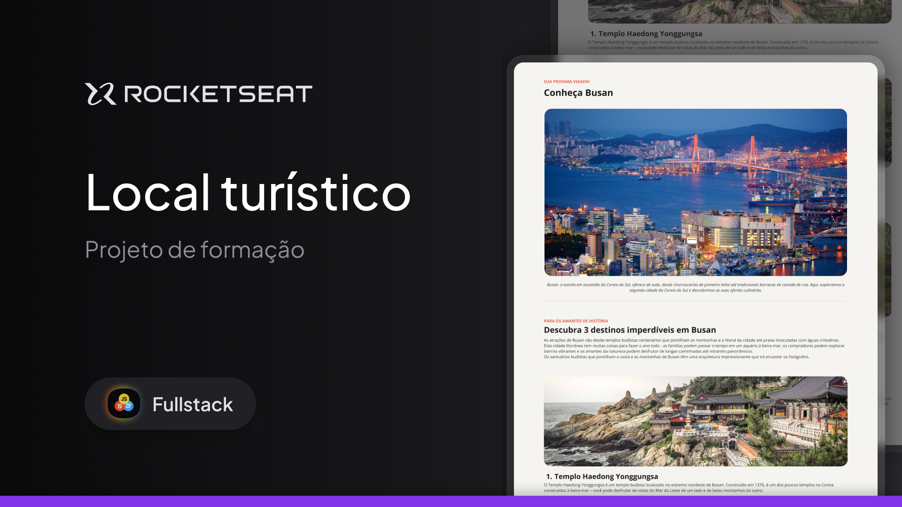

<h1 align="center">
  Projeto Local Turístico | 
</h1>

  
  
  
  
  
  

  
  
  

  <a href="#-Sobre">Sobre</a>&nbsp;&nbsp;&nbsp;|&nbsp;&nbsp;&nbsp;
  <a href="#-Tecnologias">Tecnologias</a>&nbsp;&nbsp;&nbsp;|&nbsp;&nbsp;&nbsp;
  <a href="#-Layout">Layout</a>&nbsp;&nbsp;&nbsp;|&nbsp;&nbsp;&nbsp;
  <a href="#-Entre-em-contato">Contato</a>

## 📚 Sobre

    

Projeto feito durante a formação em desenvolvimento _Fullstack_ da <a href="https://rocketseat.com.br/" target="_blank">Rocketseat</a>.

A prática é a criação de uma página simples estruturada durante o _Stage 03 - "Iniciando o HTML e CSS"_ da formação citada acima.

Nesse desafio, cria-se uma aplicação, a partir de um layout pronto no Figma, para fortalecer alguns conceitos sobre estruturação e estilização de páginas.

O projeto envolve o uso de:

- Estrutura HTML;
- Estilizações com CSS;
- Fontes;
- Espaçamentos;
- Imagens;
- Listas desordenadas;
- Alterações das cores dos textos;
- Alterações dos pesos dos textos.

Confira o projeto finalizado, _online_, [aqui](https://angelicaalbuquerque.github.io/fullstack-stage03-project02_rocketseat).

Para conferir detalhes de todos os módulos do curso e seus projetos, acesse [esse repositório](https://github.com/angelicaalbuquerque/fullstack_rocketseat).

## 🚀 Tecnologias

Esse projeto foi desenvolvido com as seguintes tecnologias:

- HTML
- CSS
- Git
- Github
- Figma

## 🎨 Layout

Você pode visualizar o layout do projeto através [deste link](https://www.figma.com/community/file/1384542229391733447/local-turistico), no [Figma](http://figma.com/). É preciso ter uma conta na plataforma para acessá-lo.

## 📬 Entre em contato!

    
  
  
  <!--  -->

---

Feito com ☕ e 🖤 por Angélica Albuquerque

 

